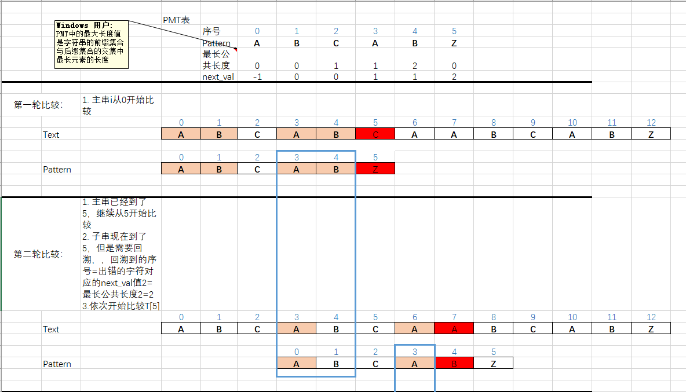
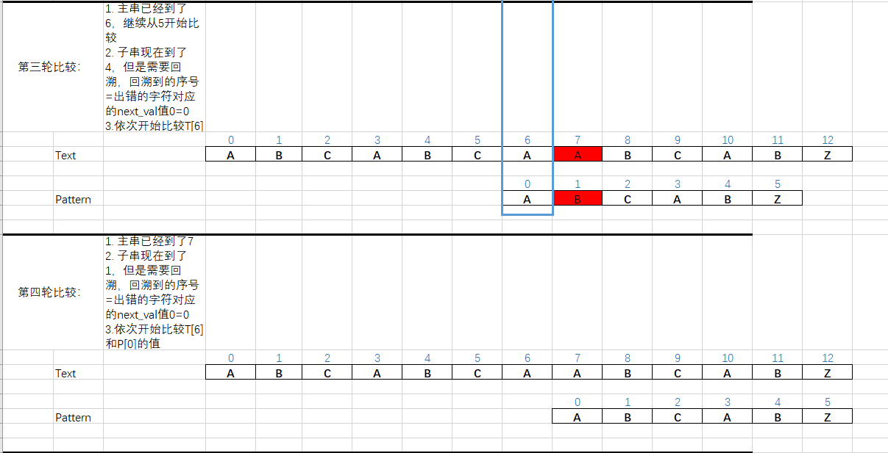
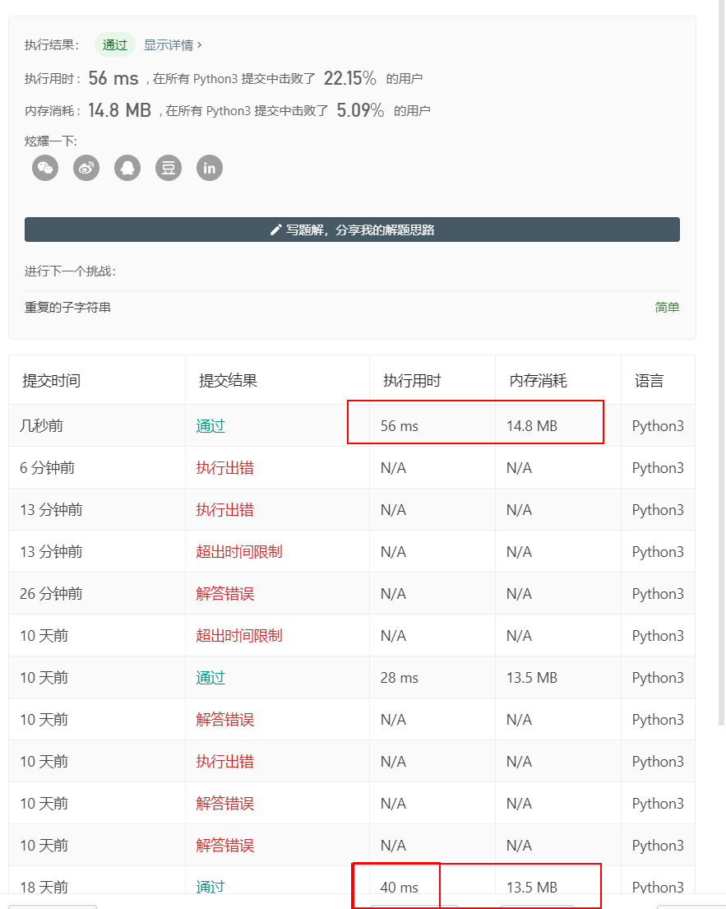

# 实现字符串查找算法

## 一、题目

给定一个 haystack 字符串和一个 needle 字符串，在 haystack 字符串中找出 needle 字符串出现的第一个位置 (从0开始)。如果不存在，则返回  -1。

示例 1:

输入: haystack = "hello", needle = "ll"
输出: 2
示例 2:

输入: haystack = "aaaaa", needle = "bba"
输出: -1
说明:

当 needle 是空字符串时，我们应当返回什么值呢？这是一个在面试中很好的问题。

对于本题而言，当 needle 是空字符串时我们应当返回 0 。这与C语言的 strstr() 以及 Java的 indexOf() 定义相符。

## 二、分析

这个问题就是一个主串里里是否包含子串的问题，我们

## 三、题解

### ① Brute-Force（BF算法）

直接依次比较

```python
class Solution:
    def strStr(self, haystack: str, needle: str) -> int:
        if not needle:
            return 0

        len_T=len(haystack)
        len_P=len(needle)

        if len_P>len_T:
            return -1

        for i in range(len_T-len_P+1):
            for j in range(len_P):
                if haystack[i+j]!=needle[j]:
                    break
                if j==len_P-1:
                    return i
        return -1
```

### ② KMP 算法

定义： 
* PMT PMT中的值是字符串的前缀集合与后缀集合的交集中最长元素的长度.例如，对于”aba”，它的前缀集合为{”a”, ”ab”}，后缀 集合为{”ba”, ”a”}。两个集合的交集为{”a”}，那么长度最长的元素就是字符串”a”了，长 度为1，所以对于”aba”而言，它在PMT表中对应的值就是1。
* next 数组各值的含义：next数组是对于模式串而言的。P 的 next 数组定义为：next[i] 表示 P[0] ~ P[i] 这一个子串，使得 前k个字符恰等于后k个字符 的最大的k. 特别地，k不能取i+1（因为这个子串一共才 i+1 个字符，自己肯定与自己相等，就没有意义了）。






```
class Solution:
    def strStr(self, haystack: str, needle: str) -> int:
        import pdb;pdb.set_trace()

        if not needle:
            return 0
        T=haystack
        P=needle

        len_T=len(T)
        len_P=len(P)

        next_list=self.get_next_val(P)
        if len_P>len_T:
            return -1
        i=0
        j=0

        while(i<len_T and j<len_P) :
                if T[i]==P[j]:  # 如果符合，则对比下一个字符
                    j+=1
                    i+=1
                elif j==-1: # 如果跳转到了P的首个字符，则让对比下一个字符
                    j+=1
                    i+=1
                else:
                    j=next_list[j]  # 如果对比不符合，则跳转到next数组对应的p去
                    i=i  

                if (j==len_P):
                    return i-j               
                 
        return -1

    def get_next_val(self,p):
        next_list=[-10]*(len(p)+1)
        next_list[0] = -1
        j = 0
        k = -1
        while j < len(p)-1 :
            if k == -1 or p[j] == p[k]:
                j  += 1
                k  += 1
                next_list[j] = k
            else:
                k = next_list[k]      #整个函数最关键的一句，用来依靠前缀和后缀相同的特性来跳过一些情况减少复杂度
        return next_list
```


## 四、结果

结果显示KMP比双指针法更慢，sad




