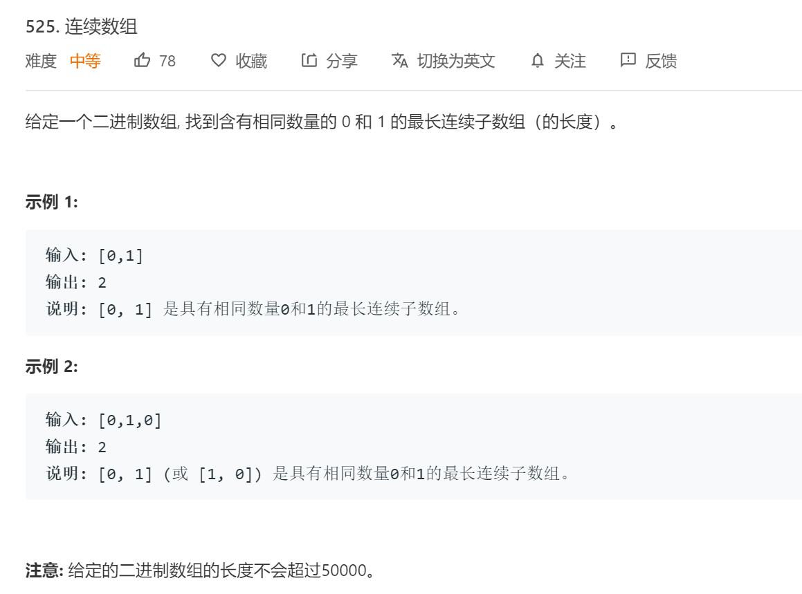

# 题目

给定一个二进制数组, 找到含有相同数量的 0 和 1 的最长连续子数组（的长度）。


# 分析题目

1. 数组只会出现 0 和 1 两种元素

2. 举例：如果输入 [0,1,1,1,0,1,0]

那么最后四位[1,0,1,0] 就是具有相同数量0和1的最长连续子数组。应该输出为4

3. 首先数组只有0 和1 两种元素，为了简化计算，我们可以先把所有的0变成-1，那么相同数量的 0 和 1 的子数组的要求其实就变成了子数组的和为0。
# 解题 1


第一种方法我们可以从数组的第一个元素开始遍历，计算每一个子数组的和为0的，并且得到这个子数组长度，取长度最大的子数组就是我们要的结果
```
class Solution:
    def findMaxLength(self, nums ) :
        max_length=0

        for i,i_value in enumerate(nums):
            sum=-1 if i_value==0 else 1
            for j,j_value in enumerate(nums):
                if j<=i:
                    continue
                if j_value==0:
                    sum-=1
                else:
                    sum+=1
                if(sum==0):
                    max_length=max(max_length,j-i+1)

        return max_length

data=[0,1,1,1,0,1,0]
ins=Solution()
result=ins.findMaxLength(data)
print("data:",data)
print("result:",result)
```

因为有2次for循环遍历，所以时间复杂度是O(n2)

# 解题 2

上面那种方法虽然做出来了，但是实际运行，leetcode报了超时，那么就要减少循环过程。
通过观察，其实可以通过计算从第一个元素到末尾的值count来计算，只要2个count的相同，那么就可以认为是具有相同数量0和1的连续子数组，就是具有
```
class Solution:
    def findMaxLength(self, nums ) :

        for index,value in enumerate(nums):
            nums[index]=-1 if value==0 else 1
        print("trans_data:",data)
        sum = 0; max_length = 0;
        count_dict={}

        for i,i_value in enumerate(nums):
            sum += nums[i];
            if sum in count_dict:
                max_length = max(max_length, i - count_dict[sum]);
            else:
                count_dict[sum] = i;           
       
        print("count_dict",count_dict)
        return max_length

data=[0,1,1,1,0,1,0]
print("raw_data:",data)
ins=Solution()
result=ins.findMaxLength(data)

print("result:",result)

```

```
raw_data: [0, 1, 1, 1, 0, 1, 0]
trans_data: [-1, 1, 1, 1, -1, 1, -1]
count_dict {-1: 0, 0: 1, 1: 2, 2: 3}
result: 4
```


         
            


