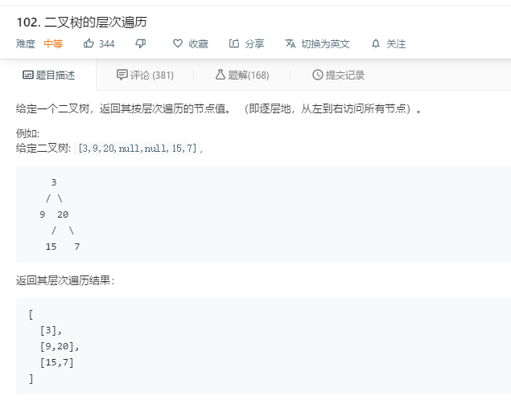
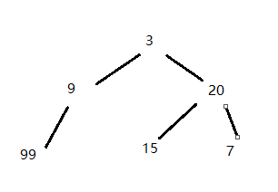

#
## 0、题目



##  1、二叉树是什么

* 树是一种数据结构,而二叉树是每个树节点最多有两个子树的一种特殊的树结构.
* 二叉树是递归类数据结构，因此大部分关于二叉树的操作都可以通过递归实现。

## 2、二叉树遍历方式
* ① 深度优先搜索（DFS）

深度优先遍历是沿着树的深度遍历树的节点，尽可能深的搜索树的分支。

* ② 广度（宽度）优先搜索（层次遍历，BFS）

从树的根节点(root)开始，从上到下从从左到右遍历整个树的节点。

-----


**一般来说，深度优先用递归，广度优先用队列。**


首个数据为根节点，后面接着是其左儿子和右儿子节点值，"null"表示不存在该子节点。

## 3.层次遍历方式

对于层次遍历需要使用队列，可按如下步骤进行：
（1）初始化一个队列
（2）二叉树的根结点放入队列
（3）重复步骤(4)-(7)直至队列为空
（4）从队列中取出一个结点x
（5）访问结点x
（6）如果x存在左子结点，将左子结点放入队列
（7）如果x 存在右子结点，将右子结点放入队列

## 4. 解题

 

 ```
 """
 思路：BFS, 处理每一层的时候记录下一层的节点，并把当前这一层每个节点的值记录到结果里。
"""
class method1.method2.Solution:
    def levelOrder(self, root):
        """
        :type root: TreeNode
        :rtype: List[List[int]]
        """
        if not root:
            return []

        queue, res = [], []
        queue.append(root)

        while queue:
            cl = []
            for _ in range(len(queue)):
                node = queue.pop(0)
                cl.append(node.val)
                if node.left:
                    queue.append(node.left)
                if node.right:
                    queue.append(node.right)
            res.append(cl)
        return res
 ```


## 5、分步运行情况
```
class TreeNode(object):
    def __init__(self, x):
        self.val = x
        self.left = None
        self.right = None

root = TreeNode(3)
level_1 = TreeNode(9)
level_2 = TreeNode(20)
level_1_1 = TreeNode(99)
level_2_1 = TreeNode(15)
level_2_2 = TreeNode(7)

root.left = level_1
root.right = level_2
level_1.left = level_1_1
level_2.left = level_2_1
level_2.right = level_2_2


class method1.method2.Solution:
    def levelOrder(self, root):
        """
        :type root: TreeNode
        :rtype: List[List[int]]
        """
        if not root:
            return []

        queue, res = [], []
        queue.append(root)

        while queue:
            print("当前正在遍历",self.print_node(queue),"这一层")
            cl = []
            for _ in range(len(queue)):
                node = queue.pop(0)
                print(self.print_node(node),"正在出队")
                cl.append(node.val)
                self.print_node(node)
                if node.left:
                    queue.append(node.left)
                    print(self.print_node(node.left),"正在入队")
                    print("当前队列的值为",self.print_node(queue))
                if node.right:
                    queue.append(node.right)
                    print(self.print_node(node.right),"正在入队")
                    print("当前队列的值为",self.print_node(queue))
            res.append(cl)
        return res

    def print_node(self,node_list):
        node_val=[]
        if isinstance(node_list,list):
            for node in node_list:
                node_val.append(node.val)
            return node_val
        elif isinstance(node_list,TreeNode):
            return node_list.val

s = method1.method2.Solution()
result = s.levelOrder(root)
print("******************")
print("最终结果是",result)
```
输出
```
当前正在遍历 [3] 这一层
3 正在出队
9 正在入队
当前队列的值为 [9]
20 正在入队
当前队列的值为 [9, 20]     
当前正在遍历 [9, 20] 这一层
9 正在出队
99 正在入队
当前队列的值为 [20, 99]
20 正在出队
15 正在入队
当前队列的值为 [99, 15]
7 正在入队
当前队列的值为 [99, 15, 7]
当前正在遍历 [99, 15, 7] 这一层
99 正在出队
15 正在出队
7 正在出队
******************
最终结果是 [[3], [9, 20], [99, 15, 7]]
```

6、复杂度

时间复杂度都是O(n)，因为它们只访问每个节点一次，不存在多余的访问。

空间是函数递归的调用栈产生的，而不是显示的额外变量。层次遍历的空间复杂度是O(w)，其中w是二叉树的宽度（拥有最多节点的层的节点数），因为层次遍历通常是用一个queue来实现的。